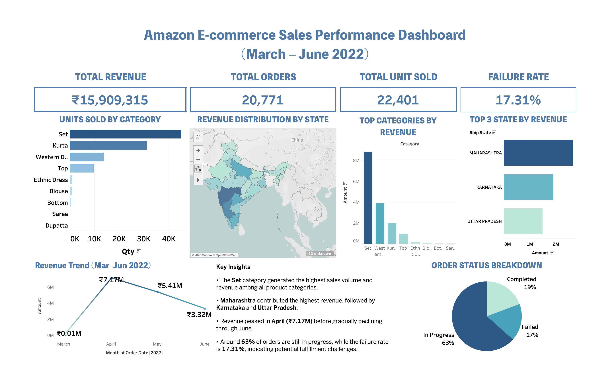

# amazon-ecommerce-sales-analysis
Data analyst portfolio project: Amazon sales data cleaning in SQL and dashboard visualization in Tableau.

## Interactive Dashboard

View the live dashboard here:

https://public.tableau.com/views/AmazonE-commerceSalesPerformanceDashboard/Dashboard1?:language=en-US&:sid=&:redirect=auth&publish=yes&showOnboarding=true&:display_count=n&:origin=viz_share_link

## Dashboard Preview

## Key Insights

• The **Set category** generated the highest units sold and revenue.

• **Maharashtra** produced the highest revenue among all states.

• Revenue peaked in **April 2022 (₹7.17M)** before declining in the following months.

• Around **63% of orders remain in progress**, while **17.31% were classified as failed**, indicating potential fulfillment issues.
